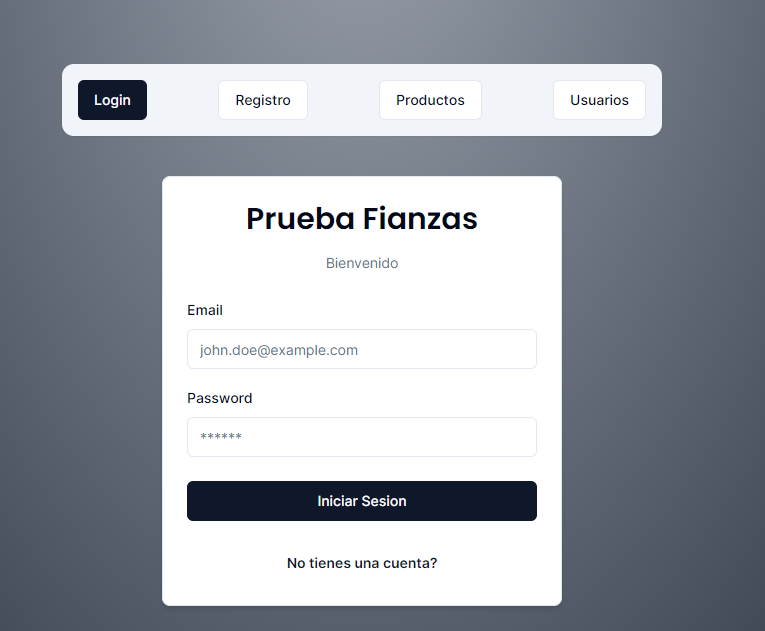

## Technical Test Fianzas Documentation

**Desarrollado:** Sebastian Felipe Martinez Samaca

**Fecha:** 2024-07-05

**Proyecto:** Prueba Tecnica Backend y Frontend

**Palabras Clave:** NodeJS, Nest.js, React, Next.js, PostgreSQL, SQL server, Vercel

**Infraestructura de despliegue:** Vercel y Railway

#### Tabla de contenido

- [Introducción](#introducción)
- [backend](#backend)
- [frontend](#frontend)
- [scrips DB](#scripts-db)
  - [PostgreSQL](#postgresql)
  - [SQL Server](#sql-server)
  - [Mockups frontend](#mockups-frontend)
  - [Porque Nestjs](#porque-nestjs)
  - [Porque Nextjs](#porque-nextjs)
- [Referencias](#referencias)

## Introducción

> .[!IMPORTANT].
> Link de la documentacion de los endpoints: [Endpoints](https://technical-test-fianzas-development.up.railway.app/docs#/)
> Link del despliegue en Vercel: [Frontend](https://technical-test-fianzas-frontend.vercel.app/)

> .[!IMPORTANT].
> Credenciales para ingresar
> Usuario: usuario@gmail.com
> Contraseña: 123456

Este proyecto es una prueba técnica para la empresa Fianzas. El proyecto se divide en dos partes, una parte backend y una parte frontend. El backend se desarrolló con Nest.js y el frontend con Next.js. La base de datos se utilizó PostgreSQL y SQL Server. La infraestructura de despliegue se realizó en Vercel y Railway.

> .[!NOTE].
> Para el despliegue de la aplicacion se utilizo Vercel y Railway, para el backend y frontend respectivamente.

## backend

### Como ejecutar el backend

1. Abrir la terminal y dirigirse a la carpeta backend-node

```bash
cd backend-node
```

2. Instalar las dependencias con el siguiente comando

```bash
npm install
```

3. Ejecutar el siguiente comando para iniciar el servidor

```bash
npm run start:dev
```

3. Abrir el navegador para ir `http://localhost:3000/docs` para ver la documentacion de los endpoints

## frontend

### Como ejecutar el frontend

1. Abrir la terminal y dirigirse a la carpeta frontend-react

```bash
cd frontend-react
```

2. Instalar las dependencias con el siguiente comando

```bash
npm install
```

3. Ejecutar el siguiente comando para iniciar el servidor

```bash
npm run dev
```

3. Abrir el navegador para ir `http://localhost:3000` para ver la aplicacion

## scripts DB

#### Modelo de la base de datos


### PostgreSQL

El script de la base de datos de PostgreSQL se encuentra en la carpeta `db-schemas` con el nombre `postgresql-schema.sql`
[Schema de Postgresqls](./db-schemas/postgresql-schema.sql)

### SQL Server

El script de la base de datos de SQL Server se encuentra en la carpeta `db-schemas` con el nombre `sql-server-schema.sql`
[Schema de SQL Server](./db-schemas/sql-server-schema.sql)

#### Procedimientos almacenados

El script de los procedimientos almacenados de SQL Server se encuentra en la carpeta `db-schemas` con el nombre `insert-stored-procedures.sql` y `update-stored-procedures.sql`
[Insert Stored Procedures de SQL Server](./db-schemas/insert-stored-procedures.sql)
[Updated Stored Procedures de SQL Server](./db-schemas/update-stored-procedures.sql)

### Mockups frontend

1. Pagina Principal



2. Pagina de Dashboard


3. Pagina de Productos


### Porque Nestjs

Nestjs es un framework de Node.js que permite crear aplicaciones escalables y eficientes. Es un framework que utiliza TypeScript, Nestjs es un framework que permite crear aplicaciones de backend de forma sencilla y rápida. Además, Nestjs es un framework que permite crear aplicaciones de backend de forma modular, lo que facilita la reutilización de código y la escalabilidad de la aplicación.

### Porque Nextjs

Nextjs es un framework de React que permite crear aplicaciones web de forma sencilla y rápida. Nextjs es un framework que permite crear aplicaciones web de forma modular, lo que facilita la reutilización de código y la escalabilidad de la aplicación. Además, Nextjs es un framework que permite crear aplicaciones web de forma eficiente, ya que utiliza el concepto de renderizado del lado del servidor.

## Referencias

- [Nestjs](https://nestjs.com/)
- [Nextjs](https://nextjs.org/)
- [Vercel](https://vercel.com/)
- [Railway](https://railway.app/)
